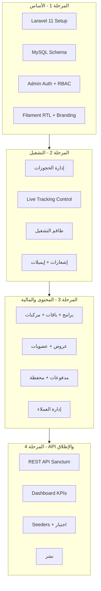
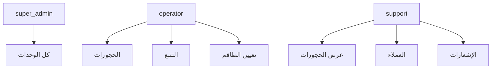
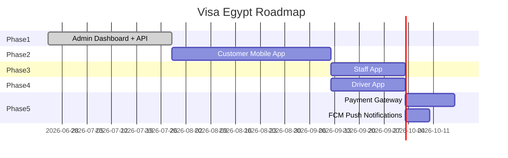

# خطة عمل شاملة — Visa Egypt Admin Dashboard

## 1. ملخص المشروع

| البند | التفاصيل |
|-------|----------|
| **المنتج** | لوحة تحكم إدارية (Admin Dashboard) + Backend API لمنظومة Visa Egypt |
| **الحالة الحالية** | مواصفات وتصميمات فقط (~58 mockup + PDF) — لا يوجد كود |
| **الهدف** | تمكين الإدارة من إدارة العملاء، الحجوزات، التتبع المباشر، البرامج، العضويات، العروض، المدفوعات، والإشعارات |
| **التقنية** | PHP Laravel 11 + Filament 3 + MySQL + Sanctum + Reverb |
| **المدة المقدرة** | 4–5 أسابيع |
| **اللغات** | عربي (RTL افتراضي) + إنجليزي |

### المراجع
- [`Visa_Egypt_Final_Developer_Handover_55_Screens.pdf`](e:\perfectsolu\visaapp\Visa_Egypt_Final_Developer_Handover_55_Screens.pdf) — 55 شاشة + data model + tracking + notifications
- [`Visa_Egypt_Arabic_System_Explanation.pdf`](e:\perfectsolu\visaapp\Visa_Egypt_Arabic_System_Explanation.pdf) — شرح عربي + متطلبات Admin
- [`Mind Map.png`](e:\perfectsolu\visaapp\Mind Map.png) — 8 أقسام رئيسية
- Mockups JPEG — brand colors + UI reference

---

## 2. نطاق العمل (Scope)

### داخل النطاق (يُبنى الآن)



### خارج النطاق (مراحل لاحقة)
- تطبيق العميل Mobile (55 شاشة) — API جاهز للربط
- Staff App / Driver App
- تكامل بوابة دفع حقيقية (Stripe/PayPal)
- FCM Push Notifications (الهيكل جاهز)

---

## 3. البنية التقنية

| الطبقة | التقنية | الغرض |
|--------|---------|-------|
| Framework | Laravel 11 | Backend + Admin + API |
| Admin UI | Filament 3 | 11 وحدة إدارية + widgets |
| Database | MySQL 8 | 15+ جدول |
| Admin Auth | Filament + Spatie Permission | super_admin / operator / support |
| Mobile Auth | Laravel Sanctum | Bearer tokens |
| Real-time | Laravel Reverb | Live Tracking broadcast |
| Queue | Laravel Queue (database) | إيميلات + إشعارات |
| Mail | Laravel Mail + SMTP | تأكيد الحجز |
| Storage | Laravel Filesystem (local/S3) | صور البرامج + staff photos |
| i18n | `lang/ar` + `lang/en` | ثنائي اللغة |

**Brand Colors:** Navy `#1B2A4A` | Teal `#2EC4B6` | Gold `#C9A227` | White `#FFFFFF`

---

## 4. قاعدة البيانات — الجداول الكاملة

### 4.1 جداول العملاء والحسابات

**`users`** (عملاء التطبيق)
| العمود | النوع | ملاحظات |
|--------|------|---------|
| id | bigint PK | |
| full_name | string | |
| email | string unique | |
| phone | string | |
| whatsapp | string nullable | |
| nationality | string | |
| language | enum(ar, en) | default ar |
| email_verified_at | timestamp nullable | |
| password | string nullable | guest users |
| created_at / updated_at | timestamps | |

**`admins`** (مستخدمو الداشبورد — Filament User)
| العمود | النوع |
|--------|------|
| id, name, email, password | standard |
| is_active | boolean |

**`memberships`**
| العمود | النوع |
|--------|------|
| user_id | FK users |
| plan_type | enum(silver, gold, platinum) |
| discount_percent | decimal |
| points_balance | integer |
| start_date, end_date | dates |
| status | enum(active, expired, cancelled) |

**`wallets`**
| العمود | النوع |
|--------|------|
| user_id | FK |
| balance, bonus_credit | decimal |
| currency | string default USD |

**`wallet_transactions`**
| العمود | النوع |
|--------|------|
| wallet_id | FK |
| type | enum(credit, debit, bonus, refund) |
| amount | decimal |
| reference | string nullable |
| description | text nullable |

### 4.2 جداول الخدمات والمحتوى

**`programs`** (Explore Egypt — 9 برامج)
| العمود | النوع |
|--------|------|
| name, slug | string |
| duration | string (e.g. "5 Days / 4 Nights") |
| cities | json |
| highlights | json |
| itinerary | json |
| inclusions, exclusions | json |
| starting_price | decimal |
| hero_image | string nullable |
| is_active, is_best_seller | boolean |
| sort_order | integer |

**`service_packages`** (Meet & Assist + Transit)
| العمود | النوع |
|--------|------|
| service_type | enum(meet_assist, transit_tour) |
| tier | string (basic, comfort, premium, vip) |
| name | string |
| price | decimal |
| features | json |
| includes_visa | boolean |
| is_popular | boolean |
| duration_hours | integer nullable (transit only) |

**`vehicles`**
| العمود | النوع |
|--------|------|
| type | enum(sedan, van, minibus) |
| name | string (e.g. Hyundai H1) |
| max_passengers, max_bags | integer |
| image | string nullable |
| is_active | boolean |

**`offers`**
| العمود | النوع |
|--------|------|
| title, description | string/text |
| service_target | enum(explore_egypt, meet_assist, airport_transfer, transit_tour) |
| discount_percent | decimal |
| membership_level | enum(all, silver, gold, platinum) nullable |
| active_from, active_to | datetime |
| is_active | boolean |

### 4.3 جداول الحجوزات والتشغيل

**`bookings`**
| العمود | النوع |
|--------|------|
| user_id | FK users |
| booking_ref | string unique (VE12345678) |
| service_type | enum(meet_assist, visa_on_arrival, airport_transfer, transit_tour, explore_egypt) |
| status | enum(pending, confirmed, assigned, in_progress, completed, cancelled, rejected) |
| program_id | FK nullable |
| service_package_id | FK nullable |
| vehicle_id | FK nullable |
| travel_date | date |
| travelers_count | integer |
| nationality | string |
| contact_email, contact_whatsapp | string |
| flight_number | string nullable |
| arrival_time | time nullable |
| meeting_point | string nullable |
| destination | string nullable |
| special_requests | json nullable |
| metadata | json nullable (بيانات إضافية حسب الخدمة) |
| total_amount | decimal nullable |
| notes | text nullable (ملاحظات الإدارة) |

**`booking_assignments`**
| العمود | النوع |
|--------|------|
| booking_id | FK |
| staff_id | FK nullable |
| vehicle_id | FK nullable |
| assigned_at | timestamp |
| assigned_by | FK admins |

**`tracking_events`**
| العمود | النوع |
|--------|------|
| booking_id | FK |
| status_key | string |
| status_label | string |
| timestamp | timestamp |
| staff_id, driver_id, guide_id | FK nullable |
| is_current | boolean |
| notes | text nullable |

**`payments`**
| العمود | النوع |
|--------|------|
| user_id | FK |
| booking_id | FK nullable |
| membership_id | FK nullable |
| amount | decimal |
| currency | string |
| method | enum(card, paypal, cash, wallet) |
| status | enum(pending, completed, failed, refunded) |
| gateway_reference | string nullable |

**`staff`**
| العمود | النوع |
|--------|------|
| type | enum(representative, driver, guide) |
| full_name | string |
| phone, whatsapp | string |
| languages | json (["en", "ar"]) |
| rating | decimal nullable |
| reviews_count | integer |
| photo | string nullable |
| license_number | string nullable (drivers) |
| is_active | boolean |

**`app_notifications`** (إشعارات داخل التطبيق)
| العمود | النوع |
|--------|------|
| user_id | FK |
| title, body | string/text |
| type | string |
| target_screen | string |
| target_id | string nullable |
| read_at | timestamp nullable |

### 4.4 جداول الإعدادات

**`settings`** (key-value)
- faq_json, terms_text, privacy_text, about_text, support_email, support_whatsapp, support_phone

---

## 5. أدوار المستخدمين (RBAC)

| الدور | الصلاحيات |
|-------|-----------|
| **super_admin** | كل شيء + إدارة المشرفين + الإعدادات |
| **operator** | حجوزات + تتبع + تعيين staff + عملاء (قراءة) |
| **support** | حجوزات (قراءة) + عملاء + إشعارات + دعم |



---

## 6. وحدات الداشبورد — التفاصيل الكاملة

### 6.1 الصفحة الرئيسية (Dashboard)

**Widgets:**
| Widget | البيانات |
|--------|---------|
| حجوزات اليوم | COUNT bookings WHERE date = today |
| حجوزات الأسبوع | COUNT last 7 days |
| إيرادات الشهر | SUM payments WHERE status = completed |
| حجوزات نشطة (Live Tracking) | COUNT WHERE status IN (assigned, in_progress) |
| تحتاج إجراء | pending + unassigned |
| رسم بياني | توزيع حسب service_type (pie) |
| جدول عاجل | آخر 10 حجوزات pending |

**معيار القبول:** الأرقام تتحدث عند إضافة/تعديل حجز.

---

### 6.2 إدارة الحجوزات (BookingResource)

**القائمة — فلاتر:**
- نوع الخدمة (5 أنواع)
- الحالة (7 حالات)
- التاريخ (من — إلى)
- بحث بـ booking_ref / اسم العميل / إيميل

**الأعمدة:** booking_ref, العميل, نوع الخدمة, التاريخ, الحالة (badge ملون), المبلغ, تاريخ الإنشاء

**صفحة التفاصيل — 3 أقسام:**
1. **بيانات العميل:** اسم، إيميل، واتساب، جنسية، عدد المسافرين
2. **تفاصيل الخدمة:** حسب النوع (رحلة، باقة، مركبة، برنامج...)
3. **التشغيل:** تعيين staff، حالة التتبع، ملاحظات الإدارة

**Actions:**
| Action | متى | النتيجة |
|--------|-----|---------|
| تأكيد الحجز | pending → confirmed | إيميل + إشعار |
| تعيين موظف | confirmed → assigned | إشعار "Service assigned" |
| إلغاء | أي حالة | إشعار + تحديث الحالة |
| قبول (Explore Egypt) | pending → confirmed | إيميل مراجعة |
| رفض (Explore Egypt) | pending → rejected | إيميل سبب الرفض |
| طلب تعديل | pending | إيميل للعميل |

**قواعد العمل (من PDF):**
- كل حجز يحصل على `booking_ref` فريد (VE + 8 أرقام)
- بعد الإرسال: إيميل تأكيد + يظهر في My Bookings
- Explore Egypt: لا دفع فوري — مراجعة يدوية

---

### 6.3 Live Tracking Control

**صفحة مخصصة:** `app/Filament/Pages/TrackingControl.php`

**الخدمات المؤهلة فقط:**
| الخدمة | خطوات التايم لاين |
|--------|------------------|
| Meet & Assist | `booking_confirmed` → `staff_assigned` → `waiting_at_airport` → `guest_met` → `service_completed` |
| Airport Transfer | `driver_assigned` → `driver_arrived` → `passenger_picked_up` → `on_the_way` → `arrived` |
| Transit Tours | `guide_assigned` → `guest_picked_up` → `tour_started` → `lunch_visits` → `returned_to_airport` |

**واجهة الصفحة:**
- قائمة الحجوزات النشطة (assigned + in_progress)
- عند الاختيار: تايم لاين عمودي (مثل mockup صفحة 55)
- Select: تعيين representative / driver / guide
- Select: تعيين مركبة (للـ Transfer/Premium)
- زر: "تحديث للحالة التالية"
- زر: "إكمال الخدمة"

**عند كل تحديث:**
1. `TrackingEvent::create()`
2. `event(TrackingStatusUpdated)` → Reverb broadcast على channel `booking.{ref}`
3. `AppNotification` للعميل
4. تحديث `booking.status`

---

### 6.4 إدارة العملاء (CustomerResource)

- قائمة + بحث (اسم، إيميل، هاتف)
- تفاصيل: بيانات شخصية + العضوية + المحفظة + تاريخ الحجوزات (RelationManager)
- قراءة فقط للـ support، تعديل لـ super_admin

---

### 6.5 CMS — البرامج السياحية (ProgramResource)

**9 برامج Explore Egypt** (من المواصفات):
1. Egypt Discovery
2. Nile Adventure
3. Cairo & Luxor Classic
4. Red Sea Escape
5. Desert & Oasis
6. Alexandria Coastal
7. Pharaonic Wonders
8. Family Egypt Fun
9. Luxury Egypt Experience

**حقول النموذج:**
- name, slug, duration, cities (tags), highlights (repeater)
- itinerary (repeater: day, title, description)
- inclusions / exclusions (repeater)
- starting_price, hero_image (upload)
- is_active, is_best_seller, sort_order

**قالب ديناميكي واحد** — كل البرامج تستخدم نفس الـ template (PDF Section 7).

---

### 6.6 إدارة الخدمات والباقات

**Meet & Assist (ServicePackageResource):**
| الباقة | السعر | مميز |
|--------|-------|------|
| Basic | $15 | — |
| Comfort | $50 | — |
| Premium | $90 | Most Popular |
| VIP | $125 | — |

**Transit Tours:**
| المدة | السعر |
|-------|-------|
| 3 ساعات | $120 |
| 6 ساعات | $180 |
| 8 ساعات | $240 |

**Vehicles (VehicleResource):**
- Sedan (حتى 3 ركاب)
- Van (حتى 5 ركاب)
- Minibus (حتى 12 راكب)

---

### 6.7 العضويات (MembershipResource)

| الخطة | الخصم | النقاط |
|-------|-------|--------|
| Silver | 10% | أساسي |
| Gold | 15% | متوسط |
| Platinum | 25% | أعلى (mockup: Egypt Discovery $595 → $446) |

- عرض العضويات النشطة
- تفعيل/إلغاء يدوي
- عرض النقاط والخصم

---

### 6.8 العروض (OfferResource)

**قاعدة المنتج:** العروض تحول لصفحات خدمات موجودة — لا صفحات مكررة.

| نوع العرض | يفتح |
|-----------|------|
| explore_egypt | Explore Egypt Programs |
| meet_assist | Meet & Assist |
| airport_transfer | Airport Transfer |
| transit_tour | Transit Tours |

---

### 6.9 المدفوعات (PaymentResource)

- سجل كل المعاملات
- فلاتر: الحالة، الطريقة، التاريخ
- عرض: المبلغ، العملة، gateway_reference
- قراءة فقط (لا تعديل يدوي في المرحلة الأولى)

---

### 6.10 المحفظة

- عرض ضمن CustomerResource (RelationManager)
- رصيد + bonus + سجل الحركات
- لا تعديل يدوي للرصيد إلا super_admin

---

### 6.11 طاقم التشغيل (StaffResource)

**3 أنواع:**
| النوع | الاستخدام |
|-------|-----------|
| representative | Meet & Assist |
| driver | Airport Transfer |
| guide | Transit Tours |

**الحقول:** اسم، صورة، هاتف، واتساب، لغات، تقييم، رقم الرخصة (سائقين)

---

### 6.12 الإشعارات (NotificationResource)

**خريطة الأحداث (PDF Section 9):**

| الحدث | عنوان الإشعار | يفتح |
|-------|--------------|------|
| إرسال حجز | Booking request received | My Bookings |
| تأكيد حجز | Booking confirmed | Booking Details |
| نجاح الدفع | Payment successful | Confirmation / Wallet |
| تفعيل عضوية | Membership activated | My Membership |
| تحديث نقاط | New benefit added | Wallet / Offers |
| عرض جديد | Exclusive offer available | Offers |
| تعيين سائق/مرشد | Service assigned | Live Tracking |
| رد دعم | Support message received | Help & Support |

- سجل الإشعارات المرسلة
- إرسال يدوي (broadcast لكل العملاء أو عميل محدد)

---

### 6.13 الإعدادات (Settings Page)

- FAQ (JSON editor)
- Terms & Conditions
- Privacy Policy
- About Us
- بيانات الدعم: إيميل، واتساب، هاتف

---

## 7. REST API — المواصفات الكاملة

**Base URL:** `/api/v1`
**Auth:** Bearer token (Sanctum)

### Authentication
| Method | Endpoint | الوصف |
|--------|----------|-------|
| POST | `/auth/register` | إنشاء حساب |
| POST | `/auth/login` | تسجيل دخول (phone/email) |
| POST | `/auth/verify-otp` | تحقق OTP |
| POST | `/auth/logout` | خروج |
| GET | `/auth/me` | بيانات المستخدم الحالي |

### Programs & Services
| Method | Endpoint | الوصف |
|--------|----------|-------|
| GET | `/programs` | قائمة برامج Explore Egypt |
| GET | `/programs/{slug}` | تفاصيل برنامج |
| GET | `/service-packages` | باقات Meet & Assist + Transit |
| GET | `/vehicles` | المركبات المتاحة |
| GET | `/offers` | العروض النشطة |

### Bookings
| Method | Endpoint | الوصف |
|--------|----------|-------|
| POST | `/bookings` | إنشاء حجز جديد |
| GET | `/bookings` | My Bookings (قائمة) |
| GET | `/bookings/{ref}` | تفاصيل حجز |
| GET | `/bookings/{ref}/tracking` | Live Tracking timeline |

### Membership & Wallet
| Method | Endpoint | الوصف |
|--------|----------|-------|
| GET | `/membership` | عضويتي الحالية |
| POST | `/membership/checkout` | شراء/ترقية عضوية |
| GET | `/wallet` | رصيد المحفظة |
| GET | `/wallet/transactions` | سجل الحركات |

### Payments
| Method | Endpoint | الوصف |
|--------|----------|-------|
| POST | `/payments` | بدء عملية دفع |
| GET | `/payments/{id}` | حالة الدفع |

### Notifications
| Method | Endpoint | الوصف |
|--------|----------|-------|
| GET | `/notifications` | قائمة الإشعارات |
| PATCH | `/notifications/{id}/read` | تعليم كمقروء |

### Profile
| Method | Endpoint | الوصف |
|--------|----------|-------|
| GET | `/profile` | بياناتي |
| PUT | `/profile` | تحديث البيانات |
| PUT | `/profile/language` | تغيير اللغة |

### Staff/Driver (للتطبيقات المستقبلية)
| Method | Endpoint | الوصف |
|--------|----------|-------|
| GET | `/staff/assignments` | مهامي اليوم |
| PATCH | `/staff/assignments/{id}/status` | تحديث حالة |

---

## 8. خطة العمل — المراحل والمهام

### المرحلة 1: الأساس (الأسبوع 1)

| # | المهمة | المخرجات | معيار القبول |
|---|--------|---------|-------------|
| 1.1 | `composer create-project laravel/laravel .` | مشروع Laravel | `php artisan serve` يعمل |
| 1.2 | إعداد MySQL + `.env` | اتصال DB | `php artisan migrate` ينجح |
| 1.3 | تثبيت Filament 3 | `/admin` panel | صفحة login تظهر |
| 1.4 | تثبيت Spatie Permission + Sanctum | packages | composer OK |
| 1.5 | إنشاء كل الـ Migrations (15 جدول) | `database/migrations/` | migrate:fresh ينجح |
| 1.6 | إنشاء Models + Enums + Relations | `app/Models/` | factories تعمل |
| 1.7 | Filament branding: logo, colors, RTL | `AdminPanelProvider` | عربي RTL + navy/teal/gold |
| 1.8 | Admin seeder: super_admin + operator + support | `DatabaseSeeder` | login بـ 3 حسابات |
| 1.9 | إعداد Git + `.gitignore` | repo | commit أول |

**مخرجات المرحلة 1:** داشبورد فارغ يعمل + DB كامل + 3 حسابات admin

---

### المرحلة 2: التشغيل اليومي (الأسبوع 2)

| # | المهمة | المخرجات |
|---|--------|---------|
| 2.1 | BookingResource: list + filters + badges | CRUD حجوزات |
| 2.2 | Booking View page: 3 أقسام تفصيل | صفحة تفاصيل |
| 2.3 | Booking Actions: confirm, cancel, assign | workflow |
| 2.4 | Explore Egypt review: accept/reject/request changes | 3 actions |
| 2.5 | `BookingRefGenerator` service (VE + 8 digits) | ref تلقائي |
| 2.6 | StaffResource: CRUD كامل | إدارة الطاقم |
| 2.7 | BookingAssignment logic | ربط staff بـ booking |
| 2.8 | TrackingControl page + timeline UI | صفحة تتبع |
| 2.9 | TrackingEvent creation + status flow | 3 أنواع خدمة |
| 2.10 | Laravel Reverb setup + broadcast | real-time |
| 2.11 | `BookingConfirmedMail` + queue | إيميل تأكيد |
| 2.12 | `AppNotification` creation on status change | إشعارات |

**مخرجات المرحلة 2:** إدارة حجوزات كاملة + تتبع مباشر + إيميلات

---

### المرحلة 3: المحتوى والمالية (الأسبوع 3)

| # | المهمة | المخرجات |
|---|--------|---------|
| 3.1 | ProgramResource: CRUD + image upload + JSON fields | 9 برامج |
| 3.2 | ServicePackageResource: Meet & Assist 4 tiers | باقات |
| 3.3 | ServicePackageResource: Transit 3 durations | ترانزيت |
| 3.4 | VehicleResource: 3 أنواع مركبات | مركبات |
| 3.5 | OfferResource: CRUD + service_target | عروض |
| 3.6 | MembershipResource: عرض + تفعيل | عضويات |
| 3.7 | PaymentResource: read-only log | مدفوعات |
| 3.8 | CustomerResource + wallet RelationManager | عملاء |
| 3.9 | NotificationResource + manual send | إشعارات |
| 3.10 | Settings page: FAQ, Terms, Support info | إعدادات |

**مخرجات المرحلة 3:** كل الـ CMS + المالية + العملاء

---

### المرحلة 4: API والإطلاق (الأسبوع 4–5)

| # | المهمة | المخرجات |
|---|--------|---------|
| 4.1 | API Auth endpoints (Sanctum) | 5 endpoints |
| 4.2 | API Programs + Services + Offers | 5 endpoints |
| 4.3 | API Bookings CRUD + tracking | 4 endpoints |
| 4.4 | API Membership + Wallet + Payments | 5 endpoints |
| 4.5 | API Notifications + Profile | 4 endpoints |
| 4.6 | API Form Requests + Resources | validation |
| 4.7 | Dashboard widgets: StatsOverview + Chart | KPIs |
| 4.8 | PendingActionsTable widget | جدول عاجل |
| 4.9 | Database Seeders: 9 programs, 4 packages, staff, bookings | بيانات تجريبية |
| 4.10 | اختبار يدوي لكل workflow | checklist |
| 4.11 | Filament export (CSV) للحجوزات والمدفوعات | تصدير |
| 4.12 | إعداد production: `.env`, queue worker, Reverb | نشر |

**مخرجات المرحلة 4:** API جاهز + KPIs + seeders + جاهز للنشر

---

## 9. هيكل الملفات النهائي

```
visaapp/
├── app/
│   ├── Enums/
│   │   ├── BookingStatus.php
│   │   ├── ServiceType.php
│   │   ├── StaffType.php
│   │   ├── MembershipPlan.php
│   │   └── PaymentStatus.php
│   ├── Filament/
│   │   ├── Resources/          (9 resources)
│   │   ├── Pages/
│   │   │   ├── TrackingControl.php
│   │   │   └── Settings.php
│   │   └── Widgets/
│   │       ├── StatsOverview.php
│   │       ├── BookingsChart.php
│   │       └── PendingActionsTable.php
│   ├── Http/
│   │   ├── Controllers/Api/V1/  (8 controllers)
│   │   ├── Requests/Api/        (form validation)
│   │   └── Resources/Api/       (JSON transformers)
│   ├── Models/                  (15 models)
│   ├── Services/
│   │   ├── BookingRefGenerator.php
│   │   ├── TrackingService.php
│   │   └── NotificationService.php
│   ├── Events/
│   │   └── TrackingStatusUpdated.php
│   ├── Listeners/
│   ├── Mail/
│   │   └── BookingConfirmedMail.php
│   └── Notifications/
│       └── BookingStatusChanged.php
├── database/
│   ├── migrations/              (15+ files)
│   ├── seeders/
│   │   ├── AdminSeeder.php
│   │   ├── ProgramSeeder.php
│   │   ├── ServicePackageSeeder.php
│   │   ├── StaffSeeder.php
│   │   └── DemoBookingSeeder.php
│   └── factories/
├── routes/
│   ├── api.php
│   ├── channels.php
│   └── web.php
├── lang/
│   ├── ar/
│   └── en/
├── resources/views/
│   ├── filament/pages/tracking-control.blade.php
│   └── mail/booking-confirmed.blade.php
├── tests/
│   ├── Feature/Api/
│   └── Feature/Filament/
├── composer.json
├── .env.example
└── README.md
```

---

## 10. خطة الاختبار

| # | السيناريو | الخطوات | النتيجة المتوقعة |
|---|----------|---------|-----------------|
| T1 | حجز Meet & Assist | إنشاء → تأكيد → تعيين staff → تحديث tracking | تايم لاين كامل + إشعار |
| T2 | حجز Explore Egypt | إنشاء → مراجعة → قبول | إيميل + حالة confirmed |
| T3 | رفض Explore Egypt | إنشاء → رفض | إيميل + حالة rejected |
| T4 | Airport Transfer | حجز → تعيين driver → 5 خطوات tracking | tracking كامل |
| T5 | Transit Tour | حجز → دفع → تعيين guide → tracking | tracking كامل |
| T6 | عضوية Platinum | تفعيل → خصم 25% على حجز | سعر مخفض |
| T7 | عرض → خدمة | إنشاء عرض meet_assist → يظهر في API | redirect صحيح |
| T8 | API auth | register → login → token → me | 200 OK |
| T9 | RBAC | operator لا يصل للإعدادات | 403 |
| T10 | Reverb | تحديث tracking من admin → API يرجع الحالة الجديدة | real-time |

---

## 11. خطة النشر

| الخطوة | الأمر / الإجراء |
|--------|----------------|
| 1 | سيرفر: PHP 8.2+, MySQL 8, Nginx/Apache, Composer, Node |
| 2 | `git clone` + `composer install --optimize-autoloader --no-dev` |
| 3 | `cp .env.example .env` + إعداد DB + MAIL + REVERB |
| 4 | `php artisan key:generate` |
| 5 | `php artisan migrate --force` |
| 6 | `php artisan db:seed --class=AdminSeeder` |
| 7 | `php artisan storage:link` |
| 8 | `npm run build` |
| 9 | Supervisor: `php artisan queue:work` |
| 10 | Supervisor: `php artisan reverb:start` |
| 11 | SSL + domain (e.g. `admin.visaegypt.com`) |

---

## 12. خارطة الطريق المستقبلية



| المرحلة | المدة | الوصف |
|---------|-------|-------|
| **الحالية** | 4–5 أسابيع | Admin Dashboard + API |
| **التالية** | 6–7 أسابيع | Customer Mobile App (55 شاشة) على نفس API |
| **بعدها** | 3 أسابيع | Staff App (تحديث حالات Meet & Assist) |
| **بعدها** | 3 أسابيع | Driver App (تحديث حالات Transfer) |
| **تحسينات** | 2 أسابيع | Stripe/PayPal + FCM Push |

---

## 13. ملخص المخرجات النهائية

عند اكتمال الخطة سيكون لديك:

- [ ] داشبورد إداري كامل بـ 11 وحدة على `/admin`
- [ ] 15+ جدول في MySQL مع علاقات كاملة
- [ ] 3 أدوار admin (super_admin, operator, support)
- [ ] إدارة حجوزات بـ 5 أنواع خدمة + 7 حالات
- [ ] Live Tracking لـ 3 خدمات تشغيلية
- [ ] CMS لـ 9 برامج + 4 باقات + 3 مركبات + عروض
- [ ] إدارة عضويات Silver/Gold/Platinum
- [ ] سجل مدفوعات ومحفظة
- [ ] 8 أنواع إشعارات + إيميلات تأكيد
- [ ] REST API بـ 25+ endpoint (Sanctum)
- [ ] Real-time عبر Laravel Reverb
- [ ] بيانات تجريبية (seeders)
- [ ] واجهة عربية RTL + إنجليزي
- [ ] جاهز للنشر على سيرفر production

---

## 14. البدء

عند الموافقة على الخطة، أول خطوة تنفيذ:

```bash
composer create-project laravel/laravel .
composer require filament/filament:"^3.0" spatie/laravel-permission
php artisan filament:install --panels
php artisan migrate
```

ثم بناء الـ Migrations والـ Models والـ Filament Resources حسب ترتيب المراحل أعلاه.
